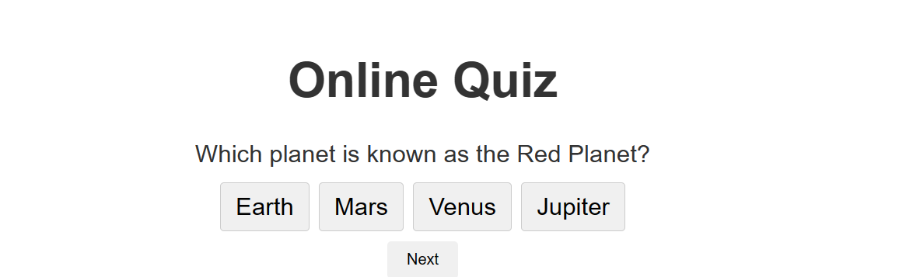
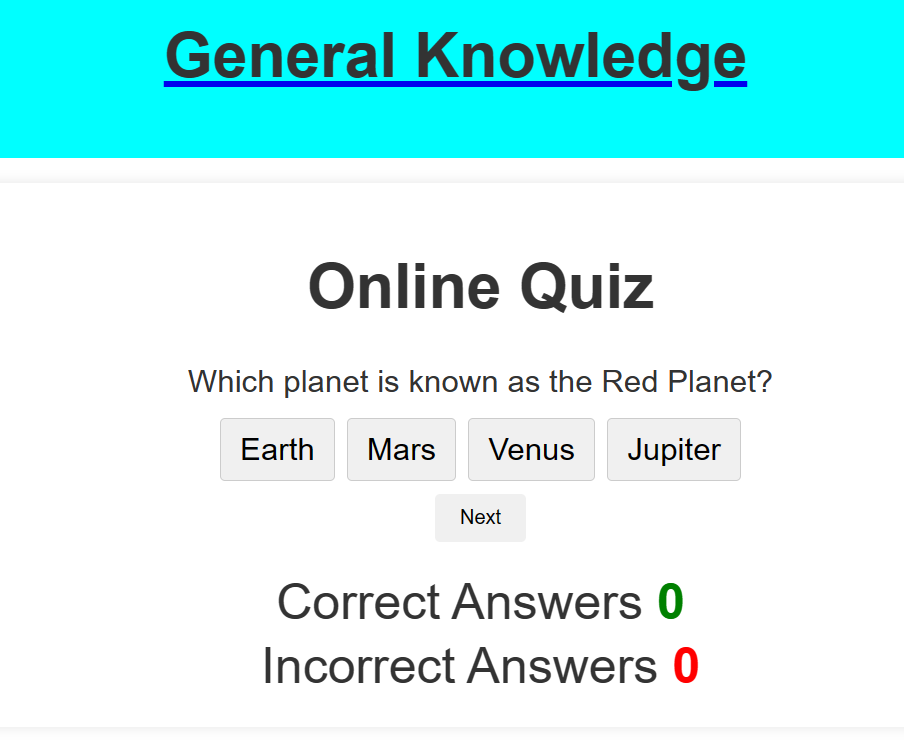

This web application is an online quiz platform that challenges users with a set of general knowledge questions. Users can test their knowledge and receive instant feedback on their answers. The quiz covers various topics, including geography, science, literature, and more.

## Screenshots:
.png)
.png)

## Table of Contents:
- [Screenshots:](#screenshots)
- [Table of Contents:](#table-of-contents)
- [Getting Started:](#getting-started)
- [Quiz Structure:](#quiz-structure)
  - [Header:](#header)
  - [Main Container:](#main-container)
  - [Score Information:](#score-information)
  - [End Message:](#end-message)
- [Styling:](#styling)
- [Validator Testing:](#validator-testing)
  - [HTML Validator:](#html-validator)
  - [CSS Validator:](#css-validator)
  - [JavaScript Validator:](#javascript-validator)
- [Footer:](#footer)
- [Quiz Logic:](#quiz-logic)
- [Play Again:](#play-again)
- [Deployment:](#deployment)
- [Credits:](#credits)
  - [Content and Code:](#content-and-code)
  - [Trivia Questions:](#trivia-questions)
  - [Media:](#media)

## Getting Started:
To get started with the Online Quiz:
1. Clone or download this repository.
2. Open the `index.html` file in your preferred web browser.

## Quiz Structure:
### Header:
The header section includes the title of the quiz, "General Knowledge," providing a link to the main page.

### Main Container:
The main container holds the online quiz, featuring:

- Heading: "Online Quiz"
- Quiz Container: Displaying the current question and answer options.
- Next Button: Allows users to navigate to the next question.
- Result Container: Displays the user's score.

### Score Information:
Additional information is provided, showcasing:

- Number of Correct Answers
- Number of Incorrect Answers

### End Message:
Upon completing the quiz, an end message is displayed, indicating the user's final score. Users can choose to play again.

## Styling:
The application has a clean and user-friendly design with notable styles including:
- Overall body styling with a white background and centered content.
- Header styling with aqua background and centered text.
- Navigation links with a clean look and hover effects.
- Main container styling for the quiz area, with rounded corners and a shadow.
- Clear styling for headings, buttons, and other elements.

## Validator Testing:
### HTML Validator:
Validated the HTML code using the official W3C validator. Ensured there are no HTML errors present.

### CSS Validator:
Validated the CSS code using the official (Jigsaw) validator. Confirmed the absence of CSS errors.

### JavaScript Validator:
Checked the JavaScript code using the official Jshint validator. Verified that there are no JavaScript errors.

## Footer:
The footer section contains social media links and a copyright notice:
- Facebook
- Instagram
- Twitter
- Youtube
The copyright notice states: "&copy; 2024 Online Quiz. All rights reserved."

## Quiz Logic:
The quiz logic is implemented using JavaScript, handling:
- Loading questions and answer options dynamically.
- Checking user answers and providing feedback.
- Incrementing scores based on correct answers.
- Displaying the final score at the end of the quiz.

## Play Again:
A "Play Again" button is provided in the end message section. Clicking this button resets the quiz, allowing users to enjoy the quiz experience again.

## Deployment:
The project has been successfully deployed to GitHub Pages, providing a live and accessible version for users to interact with. The live site is now accessible at [GitHub Pages](https://github.com/tochi-bot/OnlineQuiz_General.git).

## Credits:
### Content and Code:
1. **JavaScript Tutorial:**
   - Source: [JavaScript YouTube Tutorial](https://www.youtube.com/watch?v=SBmSRK3feww)

2. **W3Schools: HTML Reference and Tutorials:**
   - Source: [W3Schools HTML](https://www.w3schools.com/html/)

3. **Code Institute Full Stack Software Development Curriculum:**
   - Source: [Code Institute Curriculum](https://learn.codeinstitute.net/ci_program/diplomainfullstacksoftwarecommoncurriculum) (specifically "Love Maths" section)

### Trivia Questions:
- Trivia questions used in the project were sourced from a dedicated trivia questions website.

### Media:
- All media used in this project, including images and icons, were created and/or modified for this specific project. No external media sources were utilized, and all visual elements are either original or appropriately licensed for use.

It's important to note that all code and content used from external sources have been appropriately credited and used in compliance with licensing and fair use.

Feel free to explore and test your general knowledge with this Online Quiz web application!"
